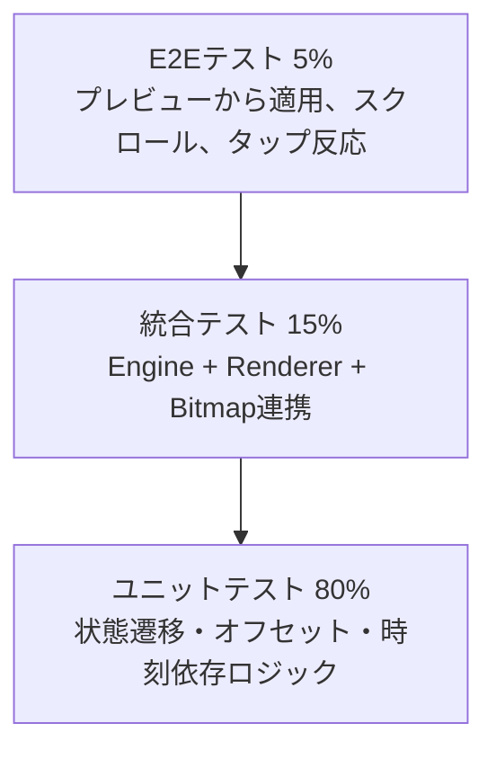
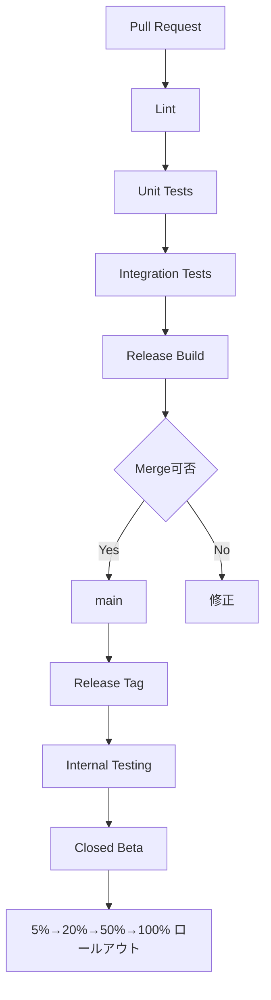

# 技術仕様書 (Architecture Design Document)

## テクノロジースタック

### 言語・ランタイム

| 技術 | バージョン |
|------|-----------|
| Android | compileSdk 34 / targetSdk 34 / minSdk 26 |
| Kotlin | 2.0.x 系 |
| Android Runtime | Android 8.0 以上 |

### フレームワーク・ライブラリ

| 技術 | バージョン | 用途 | 選定理由 |
|------|-----------|------|----------|
| Android SDK | API Level 34 / min 26 | アプリ基盤 | WallpaperService、SurfaceHolder、BitmapFactory など、必要なAPIが標準で揃っているため |
| WallpaperService | API 26+ | ライブ壁紙実装 | ホーム画面・プレビュー画面に正式対応したライブ壁紙実装手段であるため |
| Canvas / SurfaceHolder | API 26+ | 2D描画 | MVPの2D手描き風アニメーションを OpenGL なしで実現できるため |
| BitmapFactory | API 26+ | PNG素材読み込み | 透過PNG素材の読み込みとメモリ制御を直接扱えるため |
| Handler / Looper | API 26+ | フレーム更新制御 | 状態に応じて描画間隔を切り替える軽量なスケジューリングに適しているため |

### 開発ツール

| 技術 | バージョン | 用途 | 選定理由 |
|------|-----------|------|----------|
| Android Studio | Stable Channel をプロジェクト開始時点で固定 | IDE / ビルド設定 | Android開発の標準環境であり、WallpaperService の検証やプロファイリングに適しているため |
| Android Gradle Plugin | 8.7.x 系 | ビルド設定 | Kotlin 2.0.x と整合し、API Level 34 向けビルドの再現性を保ちやすいため |
| Gradle Wrapper | 8.10.x 系 | ビルド管理 | Android Gradle Plugin 8.7.x と組み合わせて再現可能なビルドを維持するため |
| JUnit | 5.10.x 系 | ユニットテスト | 状態遷移やオフセット計算などの純粋ロジックを分離テストしやすいため |
| AndroidX Test / Espresso | 1.6.x / 3.6.x 系 | 統合テスト / UIテスト | 壁紙プレビューや端末回転などの Android 実機寄り検証に向いているため |

### バージョン固定方針

| 項目 | 採用値 | 固定方針 | 理由 |
|------|--------|---------|------|
| `compileSdk` / `targetSdk` | 34 | 明示的レビューがあるまで固定 | 検証基準端末と主要APIの挙動を固定するため |
| `minSdk` | 26 | MVP期間は固定 | 古い端末対応コストを抑えつつ Android 8.0 以降をカバーするため |
| Kotlin | 2.0.x | パッチ更新のみ許可 | AGP との互換性を崩さずに修正を取り込むため |
| Android Gradle Plugin | 8.7.x | パッチ更新のみ許可 | ビルド再現性を保つため |
| Gradle Wrapper | 8.10.x | パッチ更新のみ許可 | CI とローカルのビルド差異を抑えるため |
| AndroidX Test / Espresso | 1.6.x / 3.6.x | マイナー固定、パッチ更新のみ許可 | テスト基盤の破壊的変更を避けるため |
| JUnit | 5.10.x | パッチ更新のみ許可 | テストランナーの安定性を優先するため |

## アーキテクチャパターン

### レイヤードアーキテクチャ

```
┌──────────────────────────────┐
│ Android統合レイヤー            │ ← WallpaperService / Engine / ライフサイクル
├──────────────────────────────┤
│ オーケストレーションレイヤー    │ ← フレーム更新、状態同期、描画呼び出し
├──────────────────────────────┤
│ ドメインロジックレイヤー        │ ← 猫の状態遷移、タップ反応、テーマ決定
├──────────────────────────────┤
│ 描画・アセットレイヤー          │ ← Bitmap読み込み、背景切り出し、Canvas描画
└──────────────────────────────┘
```

#### Android統合レイヤー
- **責務**: WallpaperService と Engine を通じて Android のライフサイクル、タッチ入力、サーフェス変更、壁紙オフセット通知を受け取る。
- **主な構成要素**: `CatWallpaperService`, `CatWallpaperEngine`
- **許可される操作**: オーケストレーションレイヤーへの状態通知、描画要求の起動
- **禁止される操作**: 猫の状態遷移ロジックや Bitmap 管理の直接実装

#### オーケストレーションレイヤー
- **責務**: フレームごとの状態更新順序を統括し、描画と状態遷移を調停する。
- **主な構成要素**: `FrameTicker`, `SceneState` 更新フロー, `drawFrame()`
- **許可される操作**: ドメインロジックと描画レイヤーの呼び出し
- **禁止される操作**: Android UI 依存の直接操作、永続ストレージへの依存

#### ドメインロジックレイヤー
- **責務**: 猫の状態遷移、タップ反応、後景移動範囲、昼夜テーマ選択など、ライブ壁紙としての振る舞いを定義する。
- **主な構成要素**: `CatBehaviorController`, `TouchReactionController`, `SceneThemeResolver`
- **許可される操作**: 純粋な状態変換、時刻や入力に応じた次状態の計算
- **禁止される操作**: `Canvas` への直接描画、`Resources` への直接アクセス

#### 描画・アセットレイヤー
- **責務**: Bitmap の読み込み、キャッシュ、背景切り出し、Canvas 描画を担当する。
- **主な構成要素**: `BitmapRepository`, `SceneRenderer`
- **許可される操作**: `Resources`, `BitmapFactory`, `Canvas`, `SurfaceHolder` へのアクセス
- **禁止される操作**: 猫の次状態決定やタップ優先度などの業務ロジック実装

### スレッドモデル

- 壁紙の状態更新と描画は同一のフレーム更新経路で行い、`SceneState` の更新と `render()` の呼び出し順序を固定する。
- タッチイベントやオフセット更新は Engine から受け取り、次の `drawFrame()` 実行で反映する。
- Bitmap は初期化後に読み取り専用で扱い、描画中にミュータブル変更しない。

## 状態管理戦略

### データモデルの所在

- `SceneState`、`CatStateSnapshot`、`ToyState`、`AssetSet` の詳細定義は [functional-design.md](functional-design.md#データモデル定義) に置く。
- 本書では、これらのモデルをどのレイヤーが所有し、どのルールで更新するかを定義する。

### イミュータビリティ方針

- すべてのランタイム状態は Kotlin `data class` と `val` プロパティで定義し、破壊的更新を禁止する。
- 状態更新は `copy()` で行い、部分的なミューテーションを避ける。
- ドメインロジックレイヤーは「次状態を返す」ことに専念し、描画レイヤーは状態を変更しない。

### 状態所有と更新ルール

| 項目 | 所有レイヤー | 更新契機 | 更新方法 |
|------|-------------|---------|---------|
| `SceneState` | オーケストレーションレイヤー | `drawFrame()` | `copy()` による再生成 |
| `CatStateSnapshot` | ドメインロジックレイヤーで生成、オーケストレーションレイヤーで保持 | フレーム更新、タップ反応 | `CatBehaviorController.update()` |
| `ToyState` | ドメインロジックレイヤーで生成、オーケストレーションレイヤーで保持 | タップ入力、可視期限切れ | `TouchReactionController.onTap()/update()` |
| `AssetSet` | 描画・アセットレイヤー | 初回読込、解放時 | `BitmapRepository.loadAll()/clear()` |

### イベント統合ルール

| イベント | 発生スレッド | 反映タイミング | 整合性ルール |
|---------|------------|--------------|-------------|
| `onTouchEvent()` | Engine が動作するハンドラスレッド | 次の `drawFrame()` | タップ内容は `ToyState` へ変換し、同一フレーム更新経路で消費する |
| `onOffsetsChanged()` | Engine が動作するハンドラスレッド | 次の `drawFrame()` | `wallpaperOffsetX` を正規化して `SceneState` に反映する |
| `onSurfaceChanged()` | Engine が動作するハンドラスレッド | レイアウト再計算後の最初の `drawFrame()` | `FrameTicker.cancel()` 後にサイズ更新し、再描画を再開する |
| `onVisibilityChanged(false)` | Engine が動作するハンドラスレッド | 即時 | 次フレーム予約を停止し、描画ループを継続しない |

### 状態整合性の保証

- `wallpaperOffsetX` は常に `0.0f..1.0f` にクランプする。
- 猫の `positionX` は後景移動範囲に強制的に収める。
- リリースビルドでは不整合値を安全な範囲へ丸め、クラッシュより継続動作を優先する。

## データ永続化戦略

### ストレージ方式

| データ種別 | ストレージ | フォーマット | 理由 |
|-----------|----------|-------------|------|
| 背景・猫素材 | APK内リソース | PNG (`drawable-nodpi`) | ライブ壁紙表示に必要な静的アセットであり、オフラインで即時利用できるため |
| ランタイム状態 | メモリ上のみ | Kotlin data class | MVPでは設定画面やユーザー保存データがなく、フレームごとの一時状態のみを扱うため |
| 将来の設定値 | 未導入 | 将来は DataStore / SharedPreferences を想定 | MVP時点では設定画面を持たないため、設計上の拡張ポイントのみ確保する |

### バックアップ戦略

- **MVP時点の方針**: ユーザーデータを永続化しないため、専用バックアップは不要
- **対象外**: クラウド同期、アカウント連携、設定のエクスポート/インポート
- **将来拡張**: 設定画面導入後に DataStore などの永続設定と Android 標準バックアップ可否を再検討する

## パフォーマンス要件

### レスポンスタイム

| 操作 | 測定開始点 | 測定終了点 | 目標時間 | 測定方法 |
|------|-----------|-----------|---------|---------|
| 壁紙プレビュー初回表示 | `WallpaperService.onCreateEngine()` 呼び出し | 初回 `SceneRenderer.render()` 完了 | 2秒以内 | `SystemClock.uptimeMillis()` 差分をログ計測 |
| `onSurfaceChanged()` 後の再レイアウト | `Engine.onSurfaceChanged()` 入口 | 次回 `SceneRenderer.render()` 完了 | 300ms以内 | 同上 |
| タップ反応の初回可視化 | `Engine.onTouchEvent()` で `ACTION_UP` を受理 | 毛糸玉表示を含む `SceneRenderer.render()` 完了 | 500ms以内 | 同上 |

**測定環境**:
- Google Pixel 6a / Android 14 / 6GB RAM / 1080 x 2400
- リリースビルド
- バッテリー残量 50%以上
- バックグラウンド高負荷アプリなし

### リソース使用量

| リソース | 上限 | 理由 |
|---------|------|------|
| 描画更新頻度 (`WALK` / `PLAY`) | 最大 15fps | 見た目の滑らかさを保ちつつ電池消費を抑えるため |
| 描画更新頻度 (`IDLE`) | 最大 2fps | 停止中は変化が少ないため、低頻度更新で十分なため |
| Bitmap再デコード | フレーム単位では禁止 | 毎フレームの画像読み込みは CPU / I/O / メモリ負荷が高いため |
| 背景再レイアウト計算 | オフセット変更時またはサイズ変更時のみ | 毎フレーム計算を避け、負荷を一定以下に抑えるため |
| デコード済みBitmap総量 (MVP) | 24MB以内を目標 | 低メモリ端末でもクラッシュリスクを抑えるため |

### メモリ管理戦略

| タイミング | 処理 | 方針 |
|-----------|------|------|
| `onCreateEngine()` / 初回 `onSurfaceChanged()` | 必須アセットを読み込む | 昼背景、歩き2枚、座り1枚、遊び2枚、毛糸玉のみをデコードする |
| `onVisibilityChanged(false)` | 描画予約のみ停止 | 再表示時の再読込コストを避けるため Bitmap は保持する |
| `onTrimMemory()` 相当の低メモリ通知 | 任意アセットを解放 | P1 の夜背景や未使用キャッシュを優先的に解放する |
| `onSurfaceDestroyed()` / `onDestroy()` | 全Bitmap解放 | `BitmapRepository.clear()` で `recycle()` と参照解放を行う |

### Bitmap予算とフォールバック

- 背景のデコード後メモリは 12MB 以内を目安とする。
- 猫スプライトと毛糸玉の合計は 12MB 以内を目安とする。
- デコード総量が予算を超える場合は `inSampleSize` を使って縮小読込する。
- `OutOfMemoryError` または読込失敗時は以下の順で縮退する。
	1. 夜背景を読み込まない
	2. 昼背景のみを低解像度で再読込する
	3. 猫スプライトの最小セットのみで動作を継続する

## セキュリティアーキテクチャ

### データ保護

- **暗号化**: MVPでは機密性の高い永続データを保持しないため、専用暗号化対象はない
- **アクセス制御**: リソースファイルは APK 内に含め、外部ストレージへの書き出しは行わない
- **機密情報管理**: APIキーや外部認証情報を持たないローカル完結構成とする

### 入力検証

- **バリデーション**: タップ座標は現在のサーフェス矩形内へクランプする
- **サニタイゼーション**: ホーム画面オフセットは `0.0f..1.0f` の範囲へ正規化する
- **エラーハンドリング**: 素材読み込み失敗やサーフェス無効時は安全に描画を中止し、クラッシュを避ける

### セキュリティ拡張ポイント

| 将来機能 | セキュリティ要件 | 方針 |
|---------|----------------|------|
| 設定同期 | 通信経路暗号化、匿名識別子管理 | WorkManager と暗号化ストレージを併用して後続フェーズで導入する |
| 素材ダウンロード | 改ざん検証、署名確認 | ハッシュ検証と HTTPS のみ許可する |
| 利用分析 | オプトアウト、最小データ送信 | PRD とプライバシーポリシー更新後に匿名イベントのみ許可する |

## エラーハンドリング戦略

### レイヤー別エラー処理

| レイヤー | エラー種別 | 処理方針 | ユーザー影響 |
|---------|----------|---------|-------------|
| Android統合 | `SurfaceHolder` 無効 | 描画をスキップし、次回有効化時に再試行する | 短時間のフレーム欠落のみ |
| オーケストレーション | 状態不整合 | 安全な初期状態へリセットし、次フレームを継続する | 猫位置や状態が一時的に初期化される |
| ドメインロジック | 不正入力値 | クランプまたは無視して安全値へ丸める | タップ位置やオフセットが補正される |
| 描画・アセット | Bitmap読込失敗 | フォールバック素材へ切り替え、詳細をログへ残す | 一部演出が簡略化される |
| 描画・アセット | `OutOfMemoryError` | オプション素材を解放し、低解像度で再試行する | 画質低下の可能性はあるが動作継続を優先する |

### クラッシュ防止ルール

- `drawFrame()` 全体は例外を吸収し、描画ループの停止より安全な復旧を優先する。
- `BitmapFactory.decodeResource()` と `Canvas.drawBitmap()` の失敗はレイヤー外へ例外伝播させない。
- デバッグビルドでは詳細ログを残し、リリースビルドでは過剰ログを避けて重要エラーのみを記録する。

## スケーラビリティ設計

### データ増加への対応

- **想定データ量**: MVPでは静的画像素材のみを持ち、ランタイム状態は常時1シーン分に限定する
- **パフォーマンス劣化対策**: 背景・猫・毛糸玉を固定セット化し、不要なオブジェクト生成を避ける
- **アーカイブ戦略**: MVPでは永続化データがないため不要

### 機能拡張性

- **テーマ拡張**: `SceneThemeResolver` に昼夜・天候・季節テーマを追加できる構造にする
- **設定のカスタマイズ**: 将来 `DataStore` を導入して、猫の速度や出現頻度を外部設定化できるようレイヤーを分離する
- **アニメーション拡張**: `CatBehaviorController` に新状態を追加しても `SceneRenderer` の描画責務を大きく変えない構造にする

## テスト戦略

### テストピラミッド



### ユニットテスト
- **フレームワーク**: JUnit
- **対象**: `CatBehaviorController`, `TouchReactionController`, 背景オフセット計算, フレーム間隔算出
- **カバレッジ目標**: ドメインロジック層で 80%以上
- **テストダブル戦略**:
	- 時刻取得は固定値の `Clock` 相当オブジェクトで差し替える
	- ランダム遷移はシード固定または疑似乱数生成器の注入で再現可能にする
	- `FrameTicker` の待機は即時実行ダブルで代替する

### 統合テスト
- **方法**: Android 実機またはエミュレータで WallpaperService と Engine の連携を検証する
- **対象**: プレビュー起動、壁紙適用、縦横切り替え、オフセット追従、タップ反応、Bitmap 読み込みと解放
- **テストダブル戦略**:
	- テスト用 `SurfaceHolder` と小サイズ PNG 素材を用意して描画経路を固定する
	- `BitmapRepository` にはテスト用リソースセットを注入できる構造を維持する

### E2Eテスト
- **ツール**: AndroidX Test / Espresso を中心に実施
- **シナリオ**: 壁紙選択から適用、ホーム画面スクロール、タップ反応確認、再表示復帰、夜背景フォールバック確認

### CI統合

- **トリガー**: Pull Request 作成時、main 反映時
- **実行内容**:
	- ユニットテスト
	- 統合テスト
	- `./gradlew lint`
	- リリースビルド検証
- **失敗時の扱い**: CI失敗中は main へのマージを許可しない

## デプロイメント戦略

### ビルド成果物

| 成果物 | 形式 | 用途 | 配布先 |
|-------|------|------|--------|
| Debug ビルド | APK | ローカル検証 | 開発者端末 |
| Internal Test ビルド | AAB | 内部検証 | Google Play Internal Testing |
| Release ビルド | AAB | 本番配布 | Google Play Production |

### CI/CD パイプライン



### ロールアウト方針

- 初回本番リリースは段階的ロールアウトを前提とする。
- クラッシュ率、ANR、描画不能報告が閾値を超えた場合は次段階へ進めない。
- 深刻な障害が見つかった場合は Play Console 側のロールアウト停止を優先する。

## モニタリング・ロギング戦略

### モニタリング

| 項目 | 主手段 | 補助手段 | 備考 |
|------|--------|----------|------|
| クラッシュ率 | Google Play Console / Android Vitals | Firebase Crashlytics 導入時は併用可 | Crashlytics はプライバシー方針確定後に任意導入 |
| ANR | Android Vitals | 端末ログ | 本番品質の最低監視対象 |
| 起動時間・再レイアウト時間 | デバッグ計測ログ | Firebase Performance 導入時は併用可 | MVPではローカル計測を基準とする |
| フレーム更新頻度 | デバッグログ | 開発用プロファイラ | 15fps / 2fps の逸脱を検出する |

### ログ方針

- デバッグビルドでは状態遷移、Bitmap読込、フレーム間隔、再レイアウト時間を `DEBUG` レベルで出力する。
- リリースビルドではクラッシュ直前の状態把握に必要な `ERROR` のみを出力する。
- タップ座標の絶対値はログに残さず、必要がある場合も相対位置またはカテゴリ化した値のみ扱う。

## アクセシビリティ

### MVP時点の扱い

- ライブ壁紙本体は視覚表現のみで完結し、設定画面を持たないため、MVP のアクセシビリティ対応範囲は限定的とする。
- ただし今後の設定画面追加を見越して、文字情報や操作項目を導入する画面では Android 標準アクセシビリティ要件を満たす前提で設計する。

### P1以降の設定画面要件

- TalkBack で主要操作を順序どおりに読み上げ可能にする。
- タッチターゲットは 48dp 以上を確保する。
- テキストと背景のコントラスト比は WCAG AA 相当を満たす。

## 技術的制約

### 環境要件
- **OS**: Android スマートフォン環境を前提とする
- **最小メモリ**: 明示的な端末下限は未確定だが、検証基準端末は 6GB RAM とする
- **必要ディスク容量**: 壁紙素材とアプリ本体を含むため、数十MB規模の APK を想定する
- **必要な外部依存**: 実行時の必須外部サービスは持たない。Google Play Console は配布運用上の前提とする

### パフォーマンス制約
- `WALK` / `PLAY` は最大 15fps、`IDLE` は最大 2fps を超えない
- 壁紙非表示時は描画予約を停止し、バックグラウンドで継続描画しない
- 背景切り出しとサイズ計算は必要時のみ行う

### セキュリティ制約
- 個人識別情報を収集しない
- ネットワーク通信を前提にしない
- 外部ストレージへの無制限な画像書き出しを行わない

## 依存関係管理

| ライブラリ | 用途 | バージョン管理方針 |
|-----------|------|-------------------|
| Android SDK | アプリ基盤 | `compileSdk` / `targetSdk` 34、`minSdk` 26 を固定し、明示レビュー時のみ更新 |
| Kotlin | 実装言語 | 2.0.x のパッチ更新のみ許可 |
| Android Gradle Plugin | ビルド設定 | 8.7.x のパッチ更新のみ許可 |
| AndroidX Test / Espresso | 統合テスト | 1.6.x / 3.6.x のパッチ更新のみ許可 |
| JUnit | ユニットテスト | 5.10.x のパッチ更新のみ許可 |

## データモデル設計(概要)

- データモデルの詳細構造は [functional-design.md](functional-design.md#データモデル定義) を参照する。
- 本アーキテクチャでは、`SceneState` 系モデルはオーケストレーションレイヤーの唯一の実行時状態として扱う。
- モデルは immutable とし、ドメインロジックレイヤーが次状態を生成し、描画レイヤーはそれを消費するだけに留める。
- P1 以降に設定値を導入する場合も、フレームごとの状態と永続設定値を分離したまま拡張する。

## 主要な技術判断

### Canvas ベース描画を採用する理由
- MVPの見た目は 2D スプライトアニメーション中心であり、OpenGL ほどの表現力は不要
- 実装コストとデバッグコストを抑えつつ、手描き風素材との相性がよい
- バッテリー消費を制御しやすく、フレームレートを意図的に落としやすい

### 永続化を導入しない理由
- MVPでは設定画面がなく、フレームごとの一時状態しか扱わない
- 永続化層を持たないことで初期実装とテスト範囲を狭くできる
- 将来の設定保存は別フェーズで DataStore を追加できるようにレイヤーを分離している

### 夜背景をMVPの受け皿に留める理由
- PRDでは夜背景は P1 であり、MVP の成立条件ではない
- ただし拡張時の変更差分を減らすため、`AssetSet` と `SceneThemeResolver` には受け皿を用意する
- MVPでは `DAY` 固定で描画し、夜背景未配置時は昼背景へフォールバックする