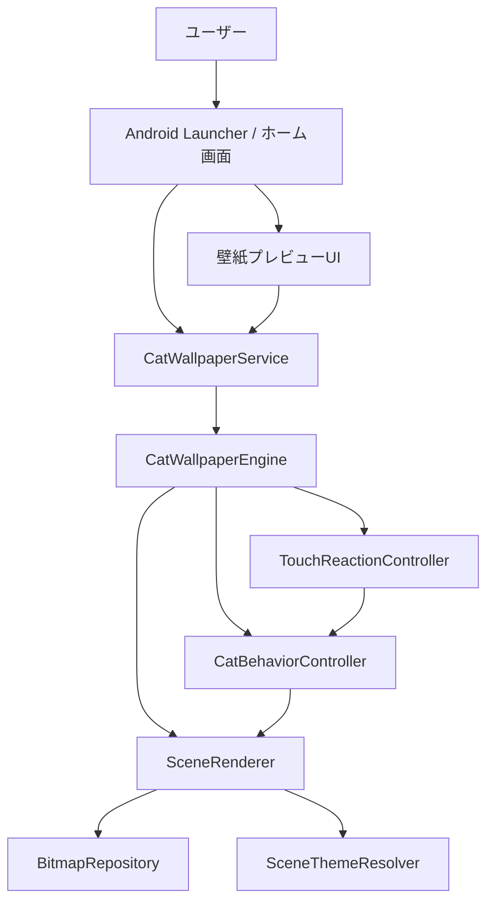
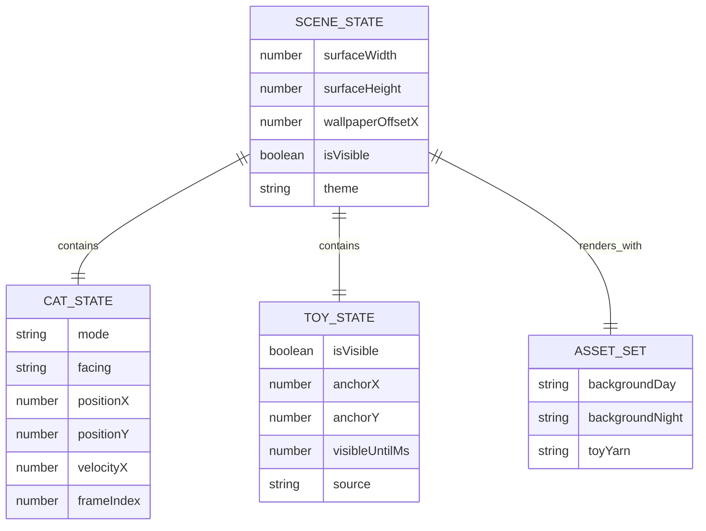
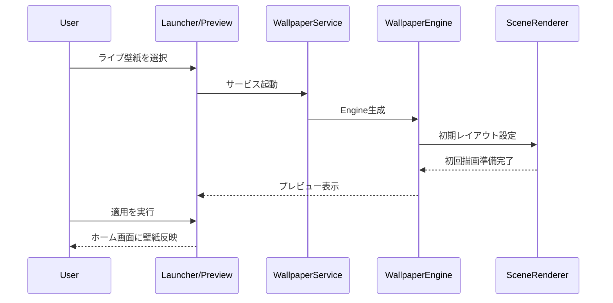
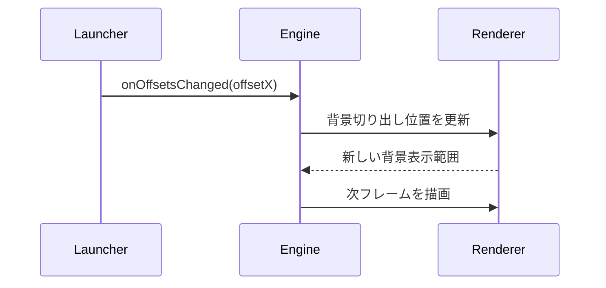
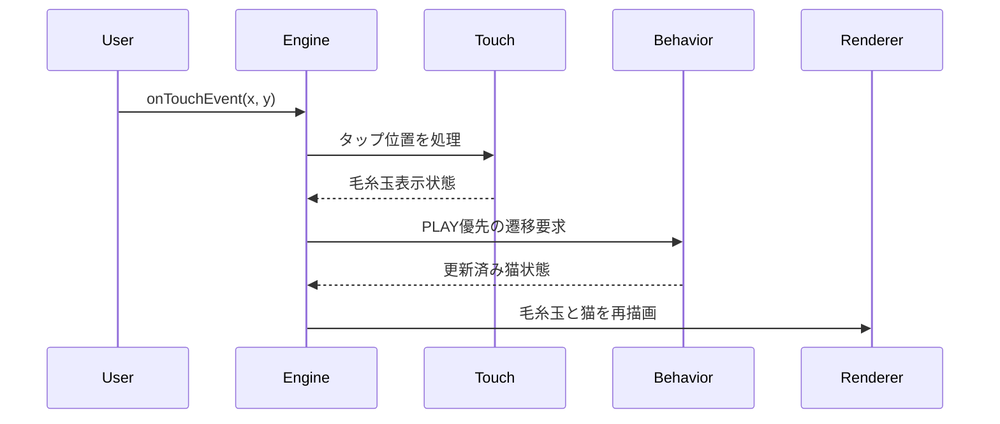
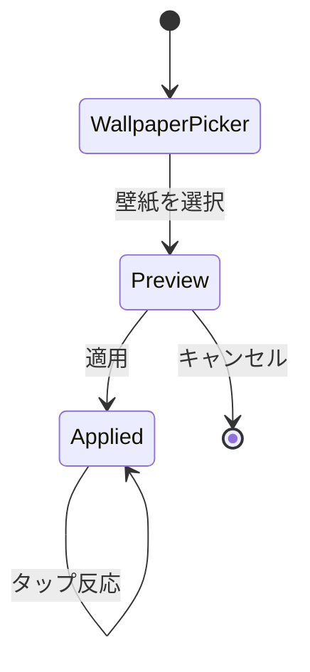

# 機能設計書 (Functional Design Document)

## システム構成図



## 技術スタック

| 分類 | 技術 | 選定理由 |
|------|------|----------|
| 言語 | Kotlin | Android標準開発での保守性が高く、WallpaperService と自然に統合できるため |
| フレームワーク | Android SDK / WallpaperService | ライブ壁紙の標準的な実装方式であり、ホーム画面・プレビュー画面との連携が可能なため |
| 描画 | Canvas / SurfaceHolder | MVPに必要な2D描画を過不足なく実現でき、OpenGLより実装負荷を抑えられるため |
| リソース管理 | BitmapFactory / drawable-nodpi | 透過PNG素材をそのまま扱いやすく、素材の読み込みと再利用を明確に制御できるため |
| スケジューリング | Handler / Runnable | 軽量なフレーム更新制御ができ、状態ごとに描画頻度を調整しやすいため |

## データモデル定義

このプロダクトのMVPでは永続化データよりもランタイム状態が重要であるため、描画と行動制御に必要な状態モデルを定義する。
コード例は実装言語に合わせて Kotlin 記法で示す。

### エンティティ: SceneState

```kotlin
data class SceneState(
    val surfaceWidth: Int,
    val surfaceHeight: Int,
    val wallpaperOffsetX: Float,
    val isVisible: Boolean,
    val theme: SceneTheme,
    val cat: CatStateSnapshot,
    val toy: ToyState,
)

enum class SceneTheme {
    DAY,
    NIGHT,
}
```

**制約**:
- `surfaceWidth` と `surfaceHeight` は `onSurfaceChanged()` でのみ更新する。
- `wallpaperOffsetX` は `0.0 <= x <= 1.0` の範囲に正規化する。

### エンティティ: CatStateSnapshot

```kotlin
data class CatStateSnapshot(
    val mode: CatMode,
    val facing: FacingDirection,
    val positionX: Float,
    val positionY: Float,
    val velocityX: Float,
    val frameIndex: Int,
    val stateStartedAtMs: Long,
    val stateDurationMs: Long,
)

enum class CatMode {
    WALK,
    IDLE,
    PLAY,
}

enum class FacingDirection {
    LEFT,
    RIGHT,
}
```

**制約**:
- `positionX` は後景移動範囲の最小値と最大値の間に収める。
- 後景移動範囲は `surfaceWidth * 0.2f` から `surfaceWidth * 0.8f` までとし、猫が前景へ出すぎないようにする。
- `frameIndex` は状態ごとの利用可能スプライト枚数を超えない。

### エンティティ: ToyState

```kotlin
data class ToyState(
    val isVisible: Boolean,
    val anchorX: Float,
    val anchorY: Float,
    val visibleUntilMs: Long,
    val source: ToySource,
)

enum class ToySource {
    USER_TAP,
    AUTO_PLAY,
}
```

**制約**:
- `isVisible` が `false` のとき `visibleUntilMs` は現在時刻以下であること。
- タップ由来の毛糸玉は画面外に配置しない。

### エンティティ: AssetSet

```kotlin
data class AssetSet(
    val backgroundDay: Bitmap,
    val backgroundNight: Bitmap?,
    val catWalkFrames: List<Bitmap>,
    val catIdleFrame: Bitmap,
    val catPlayFrames: List<Bitmap>,
    val toyYarn: Bitmap,
)
```

**制約**:
- MVP時点で必須なのは `backgroundDay`、歩き2コマ、遊び2コマ、座り1コマ、毛糸玉。
- `backgroundNight` は P1 の夜背景拡張向けの受け皿として任意とする。
- MVP時点では `SceneThemeResolver` は常に `DAY` を返し、`backgroundNight` が未配置でも動作する。

### ER図



## コンポーネント設計

### CatWallpaperService

**責務**:
- Androidのライブ壁紙サービスとしてエントリーポイントを提供する。
- `Engine` の生成とライフサイクル接続を行う。

**インターフェース**:
```kotlin
class CatWallpaperService : WallpaperService() {
    override fun onCreateEngine(): Engine {
        val frameTicker = FrameTicker(
            handler = Handler(Looper.getMainLooper()),
        )

        return CatWallpaperEngine(
            context = this,
            renderer = /* SceneRenderer implementation */,
            behaviorController = /* CatBehaviorController implementation */,
            touchReactionController = /* TouchReactionController implementation */,
            frameTicker = frameTicker,
            bitmapRepository = BitmapRepository(resources),
        )
    }
}
```

**依存関係**:
- Android `WallpaperService`
- `CatWallpaperEngine`

### CatWallpaperEngine

**責務**:
- サーフェス状態、表示状態、オフセット、タッチイベントを受け取る。
- フレーム更新の起点となり、ロジック層と描画層を調停する。

**インターフェース**:
```kotlin
class CatWallpaperEngine(
  private val context: Context,
  private val renderer: SceneRenderer,
  private val behaviorController: CatBehaviorController,
  private val touchReactionController: TouchReactionController,
  private val frameTicker: FrameTicker,
  private val bitmapRepository: BitmapRepository,
) : WallpaperService.Engine() {

  override fun onVisibilityChanged(visible: Boolean) { /* ... */ }

  override fun onSurfaceChanged(
    holder: SurfaceHolder,
    format: Int,
    width: Int,
    height: Int,
  ) { /* ... */ }

  override fun onOffsetsChanged(
    xOffset: Float,
    yOffset: Float,
    xOffsetStep: Float,
    yOffsetStep: Float,
    xPixelOffset: Int,
    yPixelOffset: Int,
  ) { /* ... */ }

  override fun onTouchEvent(event: MotionEvent) { /* ... */ }

  fun drawFrame(nowMs: Long) { /* ... */ }
}
```

**依存関係**:
- `FrameTicker`
- `CatBehaviorController`
- `TouchReactionController`
- `SceneRenderer`

**drawFrame内部フロー**:
1. `FrameTicker` のコールバックで `drawFrame(SystemClock.uptimeMillis())` を起動する。
2. `TouchReactionController.update()` で毛糸玉の有効期限を更新する。
3. `CatBehaviorController.update()` で最新の猫状態を計算する。
4. `SceneState` を immutable な `copy()` で更新する。
5. `SceneRenderer.render()` で現在フレームを描画する。
6. `sceneState.isVisible == true` の場合のみ、`FrameTicker.scheduleNext(sceneState.cat.mode) { drawFrame(SystemClock.uptimeMillis()) }` で次フレームを予約する。

```kotlin
fun drawFrame(nowMs: Long) {
  if (!sceneState.isVisible) return

  val updatedToy = touchReactionController.update(nowMs, sceneState.toy)
  val updatedCat = behaviorController.update(nowMs, sceneState.cat, updatedToy)

  sceneState = sceneState.copy(
    cat = updatedCat,
    toy = updatedToy,
  )

  renderer.render(surfaceHolder, sceneState, assetSet)
  frameTicker.scheduleNext(updatedCat.mode) {
    drawFrame(SystemClock.uptimeMillis())
  }
}
```

### SceneRenderer

**責務**:
- 背景、猫、毛糸玉を描画順に従って `Canvas` に描画する。
- 縦向き・横向きとホーム画面オフセットに応じた背景切り出し位置を計算する。

**インターフェース**:
```kotlin
interface SceneRenderer {
    fun render(holder: SurfaceHolder, sceneState: SceneState, assets: AssetSet)
    fun updateViewport(width: Int, height: Int)
    fun resolveBackgroundRect(offsetX: Float): Rect
}
```

**依存関係**:
- `BitmapRepository`
- `SceneThemeResolver`

### CatBehaviorController

**責務**:
- 猫の状態遷移、滞在時間、移動量、フレーム切り替えを管理する。
- タップ反応や自動遊びの優先順位を判断する。

**インターフェース**:
```kotlin
interface CatBehaviorController {
  fun initialize(surfaceWidth: Int, surfaceHeight: Int): CatStateSnapshot
  fun update(
    nowMs: Long,
    current: CatStateSnapshot,
    toy: ToyState,
  ): CatStateSnapshot

  fun requestPlayAt(
    current: CatStateSnapshot,
    x: Float,
    y: Float,
    nowMs: Long,
  ): CatStateSnapshot
}
```

**依存関係**:
- 乱数生成ユーティリティ
- `SceneState`

### TouchReactionController

**責務**:
- タップ座標を毛糸玉表示位置へ変換する。
- タップ反応の有効時間と画面内クランプを管理する。

**インターフェース**:
```kotlin
interface TouchReactionController {
  fun onTap(x: Float, y: Float, nowMs: Long): ToyState
  fun update(nowMs: Long, current: ToyState): ToyState
}
```

**依存関係**:
- 画面サイズ情報

### FrameTicker

**責務**:
- 猫の状態に応じた次フレームの描画間隔を制御する。
- `WALK` / `PLAY` では最大 15fps、`IDLE` では最大 2fps に制限する。
- 壁紙が非表示になったときに予約済みフレームを停止する。

**インターフェース**:
```kotlin
class FrameTicker(
  private val handler: Handler,
) {
  fun scheduleNext(mode: CatMode, onFrameRequested: () -> Unit)
  fun cancel()

  fun intervalFor(mode: CatMode): Long = when (mode) {
    CatMode.WALK, CatMode.PLAY -> 67L
    CatMode.IDLE -> 500L
  }
}
```

**依存関係**:
- Android `Handler`
- `CatMode`

### BitmapRepository

**責務**:
- リソース画像のデコード、キャッシュ、再利用を行う。
- 背景昼夜差分の取得窓口を提供する。

**インターフェース**:
```kotlin
class BitmapRepository(
    private val resources: Resources,
) {
    fun loadAll(): AssetSet
    fun getBackground(theme: SceneTheme): Bitmap
    fun clear()
}
```

**依存関係**:
- Android `Resources`
- `BitmapFactory`

**Bitmap ライフサイクル**:
- `Engine.onCreate()` または初回 `onSurfaceChanged()` で `loadAll()` を呼び、必要な Bitmap を一括読み込みする。
- `Engine.onSurfaceDestroyed()` と `Engine.onDestroy()` では `clear()` を呼び、保持中の Bitmap を `recycle()` して参照を解放する。
- MVP時点では `background_room_night.png` は読み込み可能な受け皿として扱うが、`SceneThemeResolver` が `DAY` 固定のため通常描画では使用しない。
- 将来の低メモリ対策として、実素材の解像度が大きすぎる場合は `BitmapFactory.Options.inSampleSize` による縮小読込を許容する。

## ユースケース図

### ライブ壁紙プレビューと適用



**フロー説明**:
1. ユーザーがライブ壁紙一覧またはプレビューから対象壁紙を選択する。
2. WallpaperService が起動し、Engine と描画依存が初期化される。
3. 初回描画後、プレビューで見た目を確認できる。
4. ユーザーが適用するとホーム画面で同じ描画フローが継続される。

### ホーム画面スクロールに追従した背景描画



**フロー説明**:
1. ホーム画面のページ移動に応じて Launcher が横オフセットを通知する。
2. Engine は最新の `wallpaperOffsetX` を SceneState に反映する。
3. Renderer が背景切り出し矩形を再計算し、次フレームで反映する。

### タップ反応から遊び状態へ遷移



**フロー説明**:
1. ユーザーがホーム画面上をタップする。
2. タッチ制御が毛糸玉の表示位置と有効時間を決定する。
3. 行動制御が通常遷移より `PLAY` を優先し、猫の反応を可視化する。
4. 次フレームで毛糸玉と猫の遊び状態が描画される。

## 画面遷移図



## API設計

外部APIは使用しない。MVPはローカル完結のライブ壁紙として実装する。

## アルゴリズム設計

### 猫の状態遷移アルゴリズム

**目的**: 猫の動きが単調にならず、かつ短時間で頻繁に切り替わりすぎないように制御する。

**計算ロジック**:

#### ステップ1: 現在状態の継続可否判定
- 現在時刻が `stateStartedAtMs + stateDurationMs` 未満なら状態を継続する。
- ただしタップ起因の遊び要求がある場合は通常継続より反応を優先する。

#### ステップ2: 次状態候補の選定
- 基本候補は `IDLE -> WALK -> IDLE -> PLAY` を中心に遷移する。
- `WALK` 後は `IDLE` を優先し、`PLAY` は連続しすぎないように確率を下げる。

#### ステップ3: 状態ごとのパラメータ設定
- `WALK`: 滞在時間 2,500ms - 5,000ms、左右どちらかの向き、低速移動量を設定する。
- `IDLE`: 滞在時間 2,000ms - 4,000ms、座りフレーム固定とする。
- `PLAY`: 滞在時間 1,500ms - 3,000ms、毛糸玉の有効時間と同期させる。

#### ステップ4: フレーム更新
- `WALK` / `PLAY` は 2 コマアニメーションを交互に切り替える。
- `IDLE` はフレーム固定とし、描画頻度だけを落として負荷を抑える。

**実装例**:
```kotlin
fun updateCatState(
    nowMs: Long,
    cat: CatStateSnapshot,
    toy: ToyState,
): CatStateSnapshot {
    val isPlayRequested = toy.isVisible && toy.source == ToySource.USER_TAP
    val stateEndsAt = cat.stateStartedAtMs + cat.stateDurationMs

    if (!isPlayRequested && nowMs < stateEndsAt) {
        return advanceFrame(cat, nowMs)
    }

    if (isPlayRequested) {
        return startPlayState(cat, toy.anchorX, nowMs)
    }

    return selectNextState(cat, nowMs)
}
```

### 背景オフセット計算アルゴリズム

**目的**: ホーム画面の横スクロールに応じて背景画像の見える範囲を自然に水平移動させる。

**計算ロジック**:

#### ステップ1: 背景スケール後の横幅を算出
- 背景を画面高基準または比率優先でスケーリングした後の描画幅を求める。

#### ステップ2: 横方向の余剰幅を算出
- `overflowWidth = scaledBackgroundWidth - surfaceWidth`
- 余剰が 0 以下なら中央固定とする。

#### ステップ3: オフセットに応じた切り出し始点を求める
- `sourceLeft = overflowWidth * wallpaperOffsetX`
- `sourceLeft` は 0 以上 `overflowWidth` 以下にクランプする。

**実装例**:
```kotlin
fun resolveSourceLeft(
    scaledWidth: Int,
    surfaceWidth: Int,
    offsetX: Float,
): Int {
    val overflowWidth = max(0, scaledWidth - surfaceWidth)
    return (overflowWidth * offsetX.coerceIn(0f, 1f)).toInt()
}
```

## UI設計

### 壁紙プレビュー

**表示項目**:
| 項目 | 説明 | フォーマット |
|------|------|-------------|
| 背景 | 手描き風の部屋背景 | 画面全体表示 |
| 猫 | 画面後方を移動するロシアンブルー | 透過PNGアニメーション |
| 毛糸玉 | タップまたは遊び状態で一時表示 | 透過PNG |

### 見た目の原則

**配置方針**:
- 猫は背景の後方エリアに置き、主張しすぎないサイズ感にする。
- 毛糸玉は猫の近傍、またはユーザーのタップ位置付近に一時的に表示する。
- 縦向き・横向きで被写体が画面外へ消えすぎないよう、安全マージンを設ける。

### インタラクティブモード

**操作フロー**:
1. ユーザーがホーム画面またはプレビュー画面で壁紙を見る。
2. タップすると毛糸玉が短時間表示され、猫が遊び状態へ寄る。
3. 一定時間後に通常のランダム行動へ戻る。

## ファイル構造

**実装対象構成**:
```text
app/
  src/main/
    java/com/example/catlivewallpaper/
      wallpaper/
        CatWallpaperService.kt
        CatWallpaperEngine.kt
      render/
        SceneRenderer.kt
        SceneThemeResolver.kt
        assets/
          AssetSet.kt
          BitmapRepository.kt
      logic/
        CatBehaviorController.kt
        TouchReactionController.kt
        FrameTicker.kt
      model/
        SceneState.kt
        CatStateSnapshot.kt
        ToyState.kt
        SceneTheme.kt
    res/drawable-nodpi/
      background_room_day.png
      background_room_night.png
      cat_walk_1.png
      cat_walk_2.png
      cat_sit.png
      cat_play_1.png
      cat_play_2.png
      toy_yarn.png
    res/xml/
      wallpaper.xml
```

**MVP時の夜背景の扱い**:
- `background_room_night.png` は P1 の夜背景切り替えを見据えた受け皿として配置する。
- MVPでは `SceneThemeResolver` を `DAY` 固定実装とし、夜背景ファイルが存在しても通常描画では使用しない。
- 夜背景が未配置でも昼背景へフォールバックし、MVPの動作要件は維持する。

## パフォーマンス最適化

- `FrameTicker` は PRD の非機能要件に合わせ、`WALK` / `PLAY` で 67ms 間隔、`IDLE` で 500ms 間隔を採用する。
- `WALK` / `PLAY` は最大 15fps、`IDLE` は最大 2fps を上限とし、これを超える描画予約を禁止する。
- Bitmap は初期化時にまとめて読み込み、毎フレームの再デコードを禁止する。
- Bitmap は `onSurfaceDestroyed()` と `onDestroy()` で解放し、ライフサイクルをまたいだ保持を避ける。
- `IDLE` 中は低頻度更新に切り替え、見た目に影響しない範囲で描画回数を減らす。
- 背景の切り出し矩形とスケーリング結果は `onSurfaceChanged()` または `onOffsetsChanged()` 時にのみ再計算する。
- タップ反応の描画時間を短く制御し、常時アニメーション増加を避ける。

## セキュリティ考慮事項

- ネットワーク通信を持たないローカル完結構成とし、ユーザー情報や個人識別子は扱わない。
- タップ反応や利用ログを将来追加する場合も、座標や利用状況を個人識別情報と結び付けない。

## エラーハンドリング

### エラーの分類

| エラー種別 | 処理 | ユーザーへの表示 |
|-----------|------|-----------------|
| 素材読み込み失敗 | 初期化を中止し、描画を行わない。ログへ詳細を残す | プレビュー画面で壁紙が表示されない。開発時はログで確認 |
| サーフェス無効化中の描画要求 | 描画をスキップし、次回有効化まで待機する | ユーザーには表示しない |
| 画面サイズ変更直後の一時的不整合 | レイアウト再計算後に次フレームで再描画する | 短時間の再描画のみで復旧 |
| 夜背景未配置 | 昼背景へフォールバックする | ユーザーには表示しない |

## テスト戦略

### ユニットテスト
- 猫の状態遷移ロジックが `WALK` / `IDLE` / `PLAY` を想定どおり切り替えること
- 背景オフセット計算が `offsetX` の範囲内で正しくクランプされること
- タップ座標が画面内へ正しくクランプされ、毛糸玉表示時間が制御されること

### 統合テスト
- プレビュー起動から初回描画までが検証基準端末で 2 秒以内に収まること
- ホーム画面スクロール時に背景オフセットと猫描画が破綻しないこと
- 縦向き・横向きの切り替え後に背景と猫の位置が正常に再計算されること

### E2Eテスト
- ライブ壁紙選択画面からプレビューし、そのまま適用できること
- ホーム画面上でタップ反応が視覚的に確認できること
- 画面非表示時に更新が停止し、再表示時に復帰できること