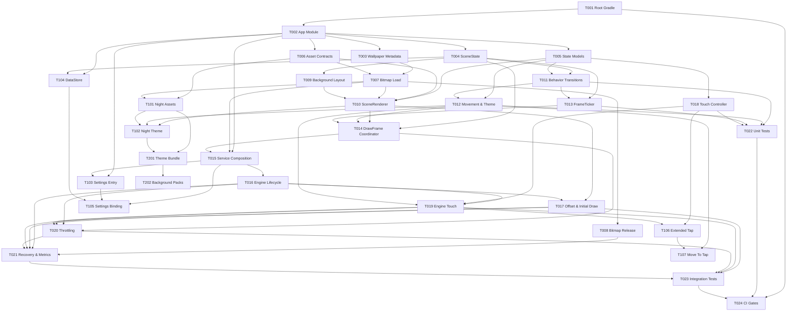

# チケット運用 README

## 目的

`docs/ticket/` は、正式ドキュメントで確定した内容を 1 チケット 1 PR 前提の実装単位へ分解して管理するためのディレクトリである。

- 正式な仕様と設計の正本は `docs/` 直下の 6 文書とする。
- `docs/ticket/` は、実装順・依存関係・PR の切り出し単位を管理する実行計画とする。
- 1 つのチケットは「1 つの責務」または「1 つの主要成果物」に絞る。

## 1 チケット 1 PR 原則

次のいずれかに該当したら、さらに分割する。

1. 1 チケットで複数レイヤーの主要責務をまたいでいる。
2. 1 チケットで 3 つ以上の主要成果物を同時に完成させる必要がある。
3. 完了条件が「実装 + 統合 + 最適化 + テスト」のように複数段階を含んでいる。
4. レビュー時に「どこを見るべき PR か」が一文で説明できない。

## 運用ルール

1. 依存チケットがすべて `done` になるまで、そのチケットを `doing` にしない。
2. 実装開始時には `.steering/YYYYMMDD-<ticket-topic>/` を作成し、チケット ID を requirements に明記する。
3. 実装完了時には、チケットのステータス、完了条件、関連する正式ドキュメント更新、検証結果を合わせて更新する。
4. チケットのスコープ変更が発生した場合は、対象チケット本文と本 README の一覧表・依存関係図を同時に更新する。
5. 正式ドキュメントとチケットの記述が競合した場合は、`docs/` 直下の正式ドキュメントを優先する。

## ステータス定義

| ステータス | 意味 |
|-----------|------|
| `ready` | 依存がなく、すぐ着手できる |
| `todo` | 実装対象だが、前提チケットの完了待ち |
| `doing` | 実装中 |
| `blocked` | 着手済みだが外部要因または設計確認待ち |
| `done` | 完了条件を満たし、関連更新も済んでいる |
| `backlog` | Post-MVP のため着手順未確定 |

## チケット一覧

### P0 基盤

| ID | ステータス | 概要 | 依存 | ファイル |
|----|-----------|------|------|---------|
| TICKET-001 | `ready` | ルート Gradle と Wrapper を整備する | なし | [TICKET-001](./TICKET-001-root-gradle-wrapper.md) |
| TICKET-002 | `todo` | `app/` モジュールの最小骨格を作る | TICKET-001 | [TICKET-002](./TICKET-002-app-module-bootstrap.md) |
| TICKET-003 | `todo` | Manifest と `wallpaper.xml` を作成する | TICKET-002 | [TICKET-003](./TICKET-003-wallpaper-metadata.md) |
| TICKET-004 | `todo` | `SceneState` の基礎モデルを実装する | TICKET-002 | [TICKET-004](./TICKET-004-scene-state-core.md) |
| TICKET-005 | `todo` | 猫 / 毛糸玉 / テーマの状態モデルを実装する | TICKET-002 | [TICKET-005](./TICKET-005-cat-toy-theme-models.md) |
| TICKET-006 | `todo` | アセット契約を定義する | TICKET-002 | [TICKET-006](./TICKET-006-asset-contracts.md) |
| TICKET-007 | `todo` | Bitmap の読込経路を実装する | TICKET-003, TICKET-006 | [TICKET-007](./TICKET-007-bitmap-loading.md) |
| TICKET-008 | `todo` | Bitmap の解放と縮退方針を実装する | TICKET-007 | [TICKET-008](./TICKET-008-bitmap-release-fallback.md) |

### P0 描画・ロジック

| ID | ステータス | 概要 | 依存 | ファイル |
|----|-----------|------|------|---------|
| TICKET-009 | `todo` | 背景レイアウト計算を実装する | TICKET-004 | [TICKET-009](./TICKET-009-background-layout.md) |
| TICKET-010 | `todo` | `SceneRenderer` を実装する | TICKET-005, TICKET-006, TICKET-007, TICKET-009 | [TICKET-010](./TICKET-010-scene-renderer.md) |
| TICKET-011 | `todo` | 猫の通常遷移ロジックを実装する | TICKET-004, TICKET-005 | [TICKET-011](./TICKET-011-behavior-transitions.md) |
| TICKET-012 | `todo` | 猫の移動範囲制御と昼テーマ解決を実装する | TICKET-005, TICKET-011 | [TICKET-012](./TICKET-012-behavior-movement-theme.md) |
| TICKET-013 | `todo` | `FrameTicker` の間隔制御を実装する | TICKET-004, TICKET-011 | [TICKET-013](./TICKET-013-frame-ticker-intervals.md) |
| TICKET-014 | `todo` | `drawFrame()` の更新順序を調停する | TICKET-004, TICKET-010, TICKET-012, TICKET-013 | [TICKET-014](./TICKET-014-drawframe-coordinator.md) |

### P0 Engine 統合と性能

| ID | ステータス | 概要 | 依存 | ファイル |
|----|-----------|------|------|---------|
| TICKET-015 | `todo` | `CatWallpaperService` の構成を実装する | TICKET-002, TICKET-007, TICKET-014 | [TICKET-015](./TICKET-015-wallpaper-service-composition.md) |
| TICKET-016 | `todo` | Engine の visibility / surface ライフサイクルを実装する | TICKET-015 | [TICKET-016](./TICKET-016-engine-visibility-surface.md) |
| TICKET-017 | `todo` | Engine の offset 反映と初回描画を実装する | TICKET-010, TICKET-016 | [TICKET-017](./TICKET-017-engine-offset-initial-draw.md) |
| TICKET-018 | `todo` | `TouchReactionController` を実装する | TICKET-005 | [TICKET-018](./TICKET-018-touch-reaction-controller.md) |
| TICKET-019 | `todo` | Engine からのタップ受理と `PLAY` 優先制御を実装する | TICKET-016, TICKET-018, TICKET-012 | [TICKET-019](./TICKET-019-engine-touch-play-priority.md) |
| TICKET-020 | `todo` | 描画頻度の throttling を実装する | TICKET-014, TICKET-016, TICKET-017, TICKET-019 | [TICKET-020](./TICKET-020-performance-throttling.md) |
| TICKET-021 | `todo` | メモリ復旧と性能計測ログを実装する | TICKET-008, TICKET-016, TICKET-017, TICKET-019, TICKET-020 | [TICKET-021](./TICKET-021-memory-recovery-measurement.md) |

### P0 品質強化

| ID | ステータス | 概要 | 依存 | ファイル |
|----|-----------|------|------|---------|
| TICKET-022 | `todo` | ロジック / オーケストレーションのユニットテストを実装する | TICKET-011, TICKET-012, TICKET-013, TICKET-018 | [TICKET-022](./TICKET-022-unit-tests-logic.md) |
| TICKET-023 | `todo` | Wallpaper フローの統合テストを実装する | TICKET-017, TICKET-019, TICKET-020, TICKET-021 | [TICKET-023](./TICKET-023-integration-tests-wallpaper.md) |
| TICKET-024 | `todo` | CI 品質ゲートを整備する | TICKET-001, TICKET-022, TICKET-023 | [TICKET-024](./TICKET-024-ci-quality-gates.md) |

### Post-MVP

| ID | ステータス | 優先度 | 概要 | 依存 | ファイル |
|----|-----------|--------|------|------|---------|
| TICKET-101 | `backlog` | `P1` | 夜背景アセットを有効化する | TICKET-006, TICKET-007 | [TICKET-101](./TICKET-101-night-assets.md) |
| TICKET-102 | `backlog` | `P1` | 夜テーマ解決と描画切替を実装する | TICKET-010, TICKET-012, TICKET-101 | [TICKET-102](./TICKET-102-night-theme-resolution.md) |
| TICKET-103 | `backlog` | `P1` | 設定画面の入口を作成する | TICKET-002, TICKET-015 | [TICKET-103](./TICKET-103-settings-entry-screen.md) |
| TICKET-104 | `backlog` | `P1` | DataStore 永続化層を実装する | TICKET-002, TICKET-004 | [TICKET-104](./TICKET-104-settings-datastore.md) |
| TICKET-105 | `backlog` | `P1` | 設定値をランタイムへ反映する | TICKET-015, TICKET-103, TICKET-104 | [TICKET-105](./TICKET-105-settings-runtime-binding.md) |
| TICKET-106 | `backlog` | `P1` | 長押し / 連続タップ反応を実装する | TICKET-018, TICKET-019 | [TICKET-106](./TICKET-106-extended-tap-reactions.md) |
| TICKET-107 | `backlog` | `P1` | タップ地点への移動反応を実装する | TICKET-012, TICKET-106 | [TICKET-107](./TICKET-107-move-to-tap-behavior.md) |
| TICKET-201 | `backlog` | `P2` | テーマ束の抽象化を実装する | TICKET-101, TICKET-102 | [TICKET-201](./TICKET-201-theme-bundle-abstraction.md) |
| TICKET-202 | `backlog` | `P2` | 追加背景パックを投入する | TICKET-201 | [TICKET-202](./TICKET-202-additional-background-packs.md) |

## 依存関係図

## 推奨着手順

1. `TICKET-001` から `TICKET-003` で Android プロジェクトの起動基盤を作る。
2. `TICKET-004` から `TICKET-008` で状態モデルとアセット基盤を固める。
3. `TICKET-009` から `TICKET-014` で描画・ロジック・フレーム更新を分離した形で成立させる。
4. `TICKET-015` から `TICKET-021` で `WallpaperService` / `Engine` 統合、反応、性能、復旧性を入れる。
5. `TICKET-022` から `TICKET-024` で品質ゲートを張る。
6. MVP 完了後に `TICKET-101` 以降の backlog へ進む。

## MVP 完了条件

以下がすべて `done` になった時点を MVP 完了とみなす。

- `TICKET-001` から `TICKET-024`
- PRD の P0 要件に対応する正式ドキュメント更新
- `development-guidelines.md` で定義した最低限の検証を通過

## チケット更新ルール

各チケットは次の情報を最低限維持する。

- ステータス
- 依存チケット
- スコープ / 除外項目
- 完了条件
- 参照ドキュメント

依存関係を変更した場合は、README の一覧表と依存関係図も必ず同時に更新する。

## 実装開始時の手順

1. `ready` または依存解消済みの `todo` チケットを 1 枚選ぶ。
2. `.steering/YYYYMMDD-<ticket-topic>/` を作成し、対象チケット ID を記載する。
3. その PR で触る正式ドキュメント更新の有無を最初に確認する。
4. 完了後はチケットと steering の両方を更新する。
